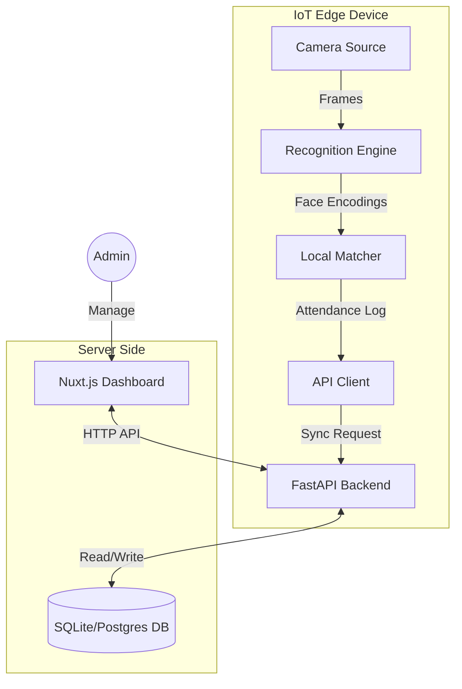

# SmartAttend-IoT Architecture Documentation

## 1. Project Overview
SmartAttend-IoT is an automated attendance system that leverages facial recognition technology. It consists of an edge IoT device (running on a Raspberry Pi or Desktop) that captures video, identifies registered students, and syncs attendance data with a central backend server. A web-based frontend allows administrators to manage students and view attendance records.

## 2. System Architecture

The system follows a client-server architecture where the IoT device acts as a smart client.



## 3. Component Details

### 3.1. IoT Client (Edge Device)
Located in the root and `core/` directories. This component runs on the physical device installed in the classroom.

*   **Entry Point**: `main.py` - Initializes the camera and recognition threads.
*   **Camera Module** (`core/camera.py`): Abstracts the video source. Supports:
    *   `DesktopCamera`: Uses standard USB webcams via OpenCV.
    *   `PiCamera`: Uses `picamera2` for Raspberry Pi hardware optimization.
*   **Recognition Engine** (`core/recognition.py`):
    *   Runs in a background thread to prevent UI blocking.
    *   Uses `face_recognition` library (dlib based) to generate 128d face encodings.
    *   Maintains a local cache of known student encodings for offline/fast matching.
*   **API Client** (`core/api_client.py`):
    *   Handles communication with the backend.
    *   Fetches student data (syncs encodings).
    *   Uploads attendance records.

### 3.2. Backend Server
Located in `backend/`. A high-performance asynchronous REST API.

*   **Framework**: FastAPI (Python).
*   **Database**: SQLAlchemy with `aiosqlite` (default) or PostgreSQL.
*   **Key Responsibilities**:
    *   **Student Management**: Create, Read, Update, Delete students.
    *   **Image Processing**: Receives student photos, generates face encodings, and stores them (as pickled objects) in the database.
    *   **Attendance Logging**: Receives and stores attendance events.
*   **Key Files**:
    *   `backend/main.py`: App definition and endpoints.
    *   `backend/models.py`: Database schema definitions.
    *   `backend/schemas.py`: Pydantic models for request/response validation.

### 3.3. Frontend Dashboard
Located in `frontend/`. A modern web interface for administrators.

*   **Framework**: Nuxt.js (Vue 3).
*   **Styling**: Tailwind CSS.
*   **Features**:
    *   Dashboard view.
    *   Student registration (with photo upload).
    *   Attendance reports.

## 4. Data Flow

### 4.1. Student Registration
1.  Admin uploads a student photo and name via the **Frontend**.
2.  **Backend** receives the photo.
3.  **Backend** detects the face and generates a 128-dimensional encoding.
4.  The encoding is serialized (pickled) and stored in the **Database**.

### 4.2. Attendance Marking
1.  **IoT Device** boots up and calls `GET /students/sync` to download all face encodings.
2.  **Camera** captures a frame.
3.  **Recognition Engine** detects faces in the frame and generates encodings.
4.  The engine compares the new encoding with the downloaded list (using Euclidean distance).
5.  If a match is found (and debounce time has passed), an attendance record is queued.
6.  **API Client** sends the record to `POST /attendance`.

## 5. Directory Structure

```
SmartAttend-IoT/
├── backend/                # FastAPI Server
│   ├── fastapi_app/       
│   ├── routers/
│   ├── database.py         # DB Connection
│   ├── main.py             # API Entry point
│   └── models.py           # DB Models
├── core/                   # IoT Device Logic
│   ├── api_client.py       # HTTP Client
│   ├── camera.py           # Camera Hardware Abstraction
│   └── recognition.py      # Face Detection Logic
├── dataset/                # Local dataset for testing/training
├── frontend/               # Nuxt.js Web App
│   ├── app/                # Vue Components & Pages
│   └── nuxt.config.ts
├── tests/                  # Unit tests
├── main.py                 # IoT Device Entry Point
└── requirements.txt        # Python Dependencies
```

## 6. Tech Stack

*   **Language**: Python 3.9+
*   **Web Frameworks**: FastAPI (Backend), Nuxt.js (Frontend)
*   **Computer Vision**: OpenCV (`cv2`), `face_recognition` (dlib)
*   **Database**: SQLite (Dev) / PostgreSQL (Prod)
*   **Hardware Support**: Generic USB Webcams, Raspberry Pi Camera Module 3
